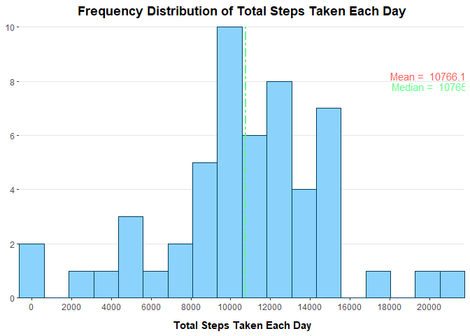
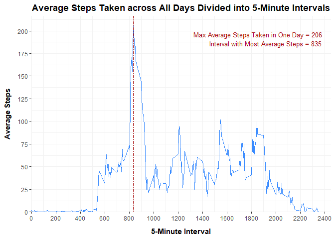
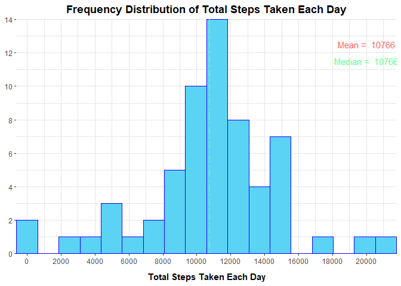
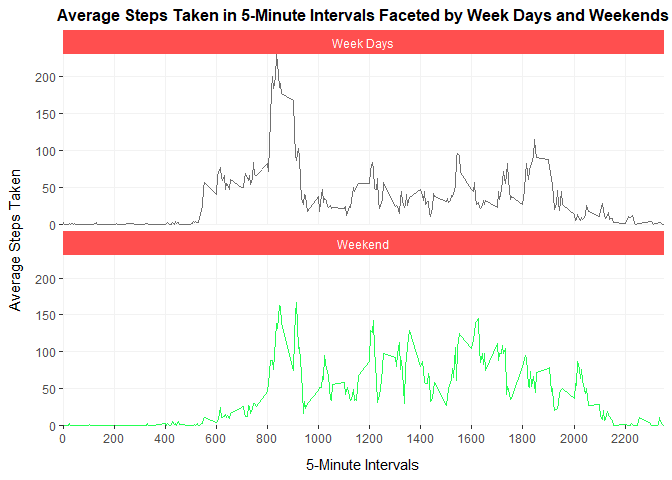

## Loading necessary libraries

```r
if(!require(tidyverse)){
     install.packages("tidyverse")
}
```

```
## Loading required package: tidyverse
```

```
## -- Attaching packages --------------------------------------- tidyverse 1.3.0 --
```

```
## v ggplot2 3.3.3     v purrr   0.3.4
## v tibble  3.1.0     v dplyr   1.0.5
## v tidyr   1.1.3     v stringr 1.4.0
## v readr   1.4.0     v forcats 0.5.1
```

```
## -- Conflicts ------------------------------------------ tidyverse_conflicts() --
## x dplyr::filter() masks stats::filter()
## x dplyr::lag()    masks stats::lag()
```

```r
library(tidyverse)
library(lubridate)
```

```
## 
## Attaching package: 'lubridate'
```

```
## The following objects are masked from 'package:base':
## 
##     date, intersect, setdiff, union
```

## Loading and preprocessing the data

```r
fileName <- unzip("activity.zip", list=TRUE)$Name
data <- read.csv(unz("activity.zip", fileName[[1]]))
```


## What is mean total number of steps taken per day?
<!-- -->


## What is the average daily activity pattern?
In this step, we first filter the data frame to remove the NA values. We then group and summarize
it by the interval and mean, respectively.
<!-- -->


## Inputing missing values
Here, we are displaying the number of missing values in the dataset. We are then substituting the missing values with the mean number of steps taken in that interval

```
## [1] "The number of missing values is: 2304"
```

<!-- -->

## Are there differences in activity patterns between weekdays and weekends?

We are using the same steps as the above section to substitute the NA values. Using the recode_factor
function, we can introduce the Week Days and Weekend factors into the data.frame. The factorized
data.frame is grouped by the "date" and "interval" variable names and then summarized based on the
mean. 

```r
correct <- data
correct[which(is.na(correct$steps)), 1] <- steps$Mean
correct <- mutate(correct, date = weekdays(ymd(date))) %>%
  mutate(date = recode_factor(date, 
                                     "Monday" = "Week Days",
                                     "Tuesday" = "Week Days",
                                     "Wednesday" = "Week Days",
                                     "Thursday" = "Week Days",
                                     "Friday" = "Week Days",
                                     "Saturday" = "Weekend",
                                     "Sunday" ="Weekend")) %>%
  group_by(date, interval) %>%
  summarize("Mean" = mean(steps), .groups = "drop")

ggplot(correct, aes(x = interval, y = Mean, color = date)) +
  geom_line() +
  labs(
    x = "5-Minute Intervals",
    y = "Average Steps Taken",
    title = "Average Steps Taken in 5-Minute Intervals Faceted by Week Days and Weekends"
  ) +
  facet_wrap(
    ~ date, 
    nrow = 2, 
    ncol = 1
  ) +
  scale_color_manual(values = c("Week Days" = "#707070", 
                                "Weekend" = "#24ff53")
  ) +
  scale_x_continuous(
    breaks = scales::breaks_width(200),
    expand = c(0,0)
  ) +
  scale_y_continuous(
    expand = c(0,0)
  ) +
  theme(
    axis.title.x = element_text(margin = margin(10,0,0,0)),
    axis.title.y = element_text(margin = margin(0,10,0,0)),
    legend.position = "none",
    strip.background = element_rect(fill = "#ff4f4f"),
    strip.text = element_text(color = "white"),
    plot.title = element_text(face = "bold", hjust = 0.5, size = 12),
    panel.background = element_blank(),
    panel.grid.major = element_line(color = "gray95")
  )
```

<!-- -->
